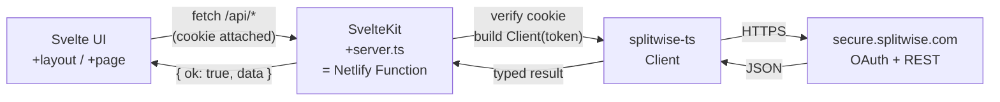

# Architecture

> The contract every contributor and agent follows. If reality and this document drift, fix the document in the same PR.

## High-level

Split-Wiser is a single-page-style SvelteKit app that talks to the Splitwise API exclusively through its own server endpoints. Browser sessions are stateless: an HMAC-signed HttpOnly cookie carries the Splitwise access token, validated on every request. There is no separate backend service — SvelteKit's `+server.ts` files are deployed by `@sveltejs/adapter-netlify` as Netlify Functions, included in the free tier.



## Folder layout

```
repo-root/
├─ src/
│  ├─ app.css                       # Tailwind v4 entry + design tokens
│  ├─ app.d.ts                      # SvelteKit ambient types (locals.session etc.)
│  ├─ app.html                      # HTML shell
│  ├─ hooks.server.ts               # Session hydration, error mapping
│  ├─ lib/
│  │  ├─ components/
│  │  │  ├─ ui/                     # shadcn-svelte primitives (Button, Card, Dialog, …)
│  │  │  ├─ split/                  # Bill-splitting feature components
│  │  │  ├─ dashboard/
│  │  │  ├─ expenses/
│  │  │  ├─ friends/
│  │  │  ├─ notifications/
│  │  │  └─ navbar.svelte
│  │  ├─ schemas/                   # zod schemas, one file per resource
│  │  ├─ server/                    # *Server-only* — never importable from .svelte
│  │  │  ├─ auth.ts                 # Cookie sign/verify, OAuth helpers
│  │  │  ├─ splitwise.ts            # SDK Client factory bound to session
│  │  │  ├─ respond.ts              # JSON envelope helpers
│  │  │  ├─ errors.ts               # Typed error classes
│  │  │  └─ env.ts                  # Centralised $env/static/private read
│  │  ├─ split/                     # Pure domain math (no Svelte, no DOM)
│  │  │  ├─ calculate-totals.ts
│  │  │  ├─ build-expense-payload.ts
│  │  │  └─ split-multi-person-item.ts
│  │  ├─ stores/                    # Svelte 5 rune stores (.svelte.ts)
│  │  │  ├─ split-store.svelte.ts
│  │  │  └─ theme-store.svelte.ts
│  │  ├─ types/                     # Shared TS types and DTOs
│  │  └─ utils/                     # cn, capitalize, format-money, …
│  └─ routes/
│     ├─ +layout.svelte             # App shell: navbar, toaster, theme
│     ├─ +layout.server.ts          # Loads { isAuthenticated, user }
│     ├─ +error.svelte              # Top-level error fallback
│     ├─ +page.svelte               # Home: bill-splitting flow
│     ├─ about/+page.svelte
│     ├─ dashboard/+page.svelte
│     ├─ dashboard/+page.server.ts
│     ├─ expenses/+page.svelte
│     ├─ expenses/+page.server.ts
│     ├─ expenses/[id]/+page.svelte
│     ├─ expenses/[id]/+page.server.ts
│     ├─ expenses/new/+page.svelte
│     ├─ friends/+page.svelte
│     ├─ friends/+page.server.ts
│     ├─ notifications/+page.svelte
│     ├─ notifications/+page.server.ts
│     ├─ auth/
│     │  ├─ login/+server.ts        # Initiates OAuth (redirect)
│     │  ├─ callback/+server.ts     # Exchanges code → token, sets cookie
│     │  └─ logout/+server.ts       # Clears cookie
│     └─ api/
│        ├─ me/+server.ts
│        ├─ groups/+server.ts
│        ├─ groups/[id]/+server.ts
│        ├─ expenses/+server.ts
│        ├─ expenses/[id]/+server.ts
│        ├─ friends/+server.ts
│        ├─ friends/[id]/+server.ts
│        ├─ comments/+server.ts
│        ├─ comments/[id]/+server.ts
│        ├─ notifications/+server.ts
│        ├─ currencies/+server.ts
│        └─ categories/+server.ts
├─ tests/                           # Playwright specs
├─ static/                          # Public assets (favicon, og image)
├─ svelte.config.js
├─ vite.config.ts
├─ tailwind.config.ts               # Optional, only if extending tokens
├─ tsconfig.json
└─ package.json
```

Co-locate unit tests as `*.test.ts` next to the file under test (`calculate-totals.ts` → `calculate-totals.test.ts`).

## Naming conventions

| Kind | Style | Example |
| --- | --- | --- |
| File names | kebab-case | `person-bill-card.svelte`, `split-store.svelte.ts` |
| Svelte components | PascalCase when imported | `import PersonBillCard from '$lib/components/split/person-bill-card.svelte'` |
| Functions, variables | camelCase | `calculateTotals`, `selectedGroup` |
| Types & interfaces | PascalCase | `Expense`, `BillState` |
| Env vars | UPPER_SNAKE | `SPLITWISE_CLIENT_SECRET` |
| Public env (browser-safe) | `PUBLIC_*` prefix | `PUBLIC_APP_URL` |
| zod schemas | `*Schema` suffix | `createExpenseSchema` |
| Stores | `*Store` suffix | `splitStore` |
| Dialogs | `*Dialog` suffix | `ManualEntryDialog.svelte` |

## TypeScript rules

`tsconfig.json` (the relevant flags):

```json
{
  "compilerOptions": {
    "strict": true,
    "noUncheckedIndexedAccess": true,
    "noImplicitOverride": true,
    "noUnusedLocals": true,
    "noUnusedParameters": true,
    "exactOptionalPropertyTypes": true
  }
}
```

Rules:

- No `any`. Use `unknown` and narrow with zod or type guards.
- Prefer `interface` for object shapes that are extended; `type` aliases otherwise.
- `import type { … }` for type-only imports.
- All exported functions in `src/lib/` get explicit return types.

## Request lifecycle

1. The browser issues `fetch('/api/<resource>', …)`. The session cookie is sent automatically (SameSite=Lax + same origin).
2. `hooks.server.ts` runs **before every request**:
   - Reads the cookie, verifies the HMAC signature, populates `event.locals.session = { token, expiresAt, userId }` or leaves it `null`.
3. The matched `+server.ts` handler:
   1. Asserts authentication where required (`requireSession(event)` throws `UnauthorizedError`).
   2. Validates the request body / query / params with the resource's zod schema.
   3. Builds an SDK client via `getClient(event)` and calls the relevant method.
   4. Wraps the result in `respond.ok(data)` or `respond.fail(code, message)`.
4. The browser receives a stable JSON envelope (see below) and updates UI state.

## Error model

```ts
// Success
{ ok: true, data: T }

// Failure
{ ok: false, error: { code: 'unauthorized' | 'validation' | 'upstream' | 'not_found' | 'unknown'; message: string; details?: unknown } }
```

Server-side throws are caught in `hooks.server.ts` `handleError` and translated:

| Thrown | Status | `code` |
| --- | --- | --- |
| `UnauthorizedError` | 401 | `unauthorized` |
| `ValidationError` (zod) | 400 | `validation` |
| `NotFoundError` | 404 | `not_found` |
| `UpstreamError` (Splitwise) | 502 | `upstream` |
| _other_ | 500 | `unknown` |

UI never reads `error.message` for branching — only `error.code`. Display strings come from a small i18n-ready map in `src/lib/utils/error-messages.ts`.

## Authentication

OAuth 2.0 **Authorization Code** flow — server only:

1. `GET /auth/login` issues a 32-byte random `state`, sets a short-lived signed `splitwise_oauth_state` cookie (10 min, HttpOnly), and 302s to `https://secure.splitwise.com/oauth/authorize?response_type=code&client_id=…&redirect_uri=…&state=…`.
2. `GET /auth/callback?code=…&state=…` validates the state cookie, exchanges the code for a token (`OAuth2User.requestAccessToken`), and sets the session cookie:
   - Name: `splitwise_session`
   - Format: `${base64url(payload)}.${base64url(hmacSha256(payload, SECRET))}`
   - Payload: `{ token, expiresAt, userId }` (JSON, then base64url)
   - Flags: `HttpOnly`, `Secure` (production), `SameSite=Lax`, `Path=/`, `Max-Age=expiresIn`.
3. `POST /auth/logout` clears the cookie and redirects to `/`.
4. There is no refresh token. Splitwise tokens are long-lived; on expiry, the user re-connects.

`event.locals.session` is the **only** allowed source of the access token. Endpoints must never accept a token from request body / header / query.

## Environment variables

| Name | Scope | Purpose |
| --- | --- | --- |
| `SPLITWISE_CLIENT_ID` | private | OAuth app client ID |
| `SPLITWISE_CLIENT_SECRET` | private | OAuth app client secret |
| `SPLITWISE_REDIRECT_URI` | private | Full callback URL (must match Splitwise app) |
| `SESSION_COOKIE_SECRET` | private | HMAC key (32+ bytes, base64) |
| `PUBLIC_APP_URL` | public | Used for generating absolute URLs in the UI |

All private vars are imported via `import { … } from '$env/static/private'`. Public vars via `$env/static/public`. Centralised in `src/lib/server/env.ts`.

## State management

- UI state lives in Svelte 5 runes (`$state`, `$derived`, `$effect`) inside `.svelte` files for component-local state.
- **Cross-component shared state** lives in `.svelte.ts` modules under `src/lib/stores/`. Example: `splitStore.svelte.ts` exports a single `splitStore` object whose properties are runes.
- **Server-fetched data** uses SvelteKit's `+page.server.ts` `load` for first paint and `fetch('/api/…')` for client mutations. We do not cache responses in the browser beyond what the browser does natively.

## Testing pyramid

| Layer | Tool | Scope |
| --- | --- | --- |
| Unit | Vitest | Pure functions in `src/lib/split/`, zod schemas, `src/lib/utils/`. ~80% of test count. |
| Component | Vitest + @testing-library/svelte (jsdom) | Forms, dialogs, list rendering. Mock fetch with `msw`. |
| E2E smoke | Playwright | Single happy path (manual entry → totals). Splitwise mocked via msw or a Playwright route handler. |

Run: `npm run test` (unit + component), `npm run test:e2e` (Playwright). CI runs both.

Snapshot tests are reserved for the rounding-discrepancy fix in `build-expense-payload.test.ts` to lock parity with the existing Angular implementation.

## Build & deploy

- `npm run build` runs `vite build` which calls `adapter-netlify`. Output goes to `.netlify/`.
- The repo-root `netlify.toml` sets `command = "npm ci && npm run build"` and `publish = "build"`. The adapter handles redirects and function packaging.
- Server endpoints (`+server.ts` and `+page.server.ts`) become individual functions automatically.
- No code in `src/lib/server/` may be imported by client code; SvelteKit's bundler enforces this and will fail the build if violated.

## Commit & branch conventions

- **Branches**: `migration/<topic>`, `feat/<topic>`, `fix/<topic>`, `chore/<topic>`. Current migration branch: `version-2`.
- **Commits**: [Conventional Commits](https://www.conventionalcommits.org/). Examples: `feat(home): add multi-person item dialog`, `fix(split): reconcile rounding on payer's owed share`, `docs: update DESIGN tokens`.
- One logical change per commit. Don't bundle refactors with features.

## Out of scope (v1)

- PWA / offline support
- Push notifications
- Multi-currency conversion (we pass currency codes as-is)
- Real-time / websocket updates
- Native mobile shell
- i18n (English only)
